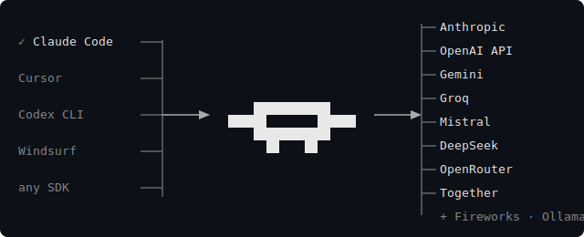

<div align="center">


# shunt

**Pool every AI provider. Route every coding agent. Never hit a rate limit again.**

[](https://crates.io/crates/shunt-proxy)
[](https://github.com/ramc10/shunt/releases)
[](LICENSE)


```bash
curl -sSf https://raw.githubusercontent.com/ramc10/shunt/main/install.sh | sh
```

</div>

---

Shunt is a local proxy that sits between your AI coding agents and every major AI provider. It pools multiple accounts, rotates across them intelligently, and presents a single unified endpoint — so your tools never see a rate limit again.

<div align="center">

</div>

---

## Supported providers

Anthropic · OpenAI · Gemini · Groq · Mistral · DeepSeek · OpenRouter · Together · Fireworks · Ollama · local LLMs

---

## Why shunt?

- **Pool multiple accounts** — two Claude Pro accounts ≈ 2× the throughput. Three ≈ 3×
- **Always picks the best account** — tracks live utilization after every response, routes to whoever has the most headroom
- **Never drops a request** — if an account hits a limit, shunt retries on the next best one instantly. If all accounts are drained, it holds your request and retries the moment the first one resets
- **Share with your team** — expose your pool over LAN or a Cloudflare tunnel with one command
- **Drop-in** — one env var and every tool you already use routes through shunt

---

## Setup

**1. Run setup**

```bash
shunt setup
```

Imports your existing Claude Code session and configures your shell automatically.

**2. Add more accounts**

```bash
shunt add-account personal   # another Claude account
shunt add-account groq       # Groq API key
shunt add-account codex      # ChatGPT Pro
```

**3. Start**

```bash
shunt start
```

Done. Claude Code, Cursor, Codex CLI — everything routes through shunt automatically.

---

## Status

```bash
shunt status    # snapshot
shunt monitor   # live fullscreen dashboard
```

```
  ◆  work                                        Claude Pro
    you@work.com

    ✓  available
    5h  ████████████░░░░░░░░  61% left  ·  resets in 2h 14m
    7d  ███░░░░░░░░░░░░░░░░░  13% left  ·  resets in 1d 14h

  ◆  personal                                    Claude Pro
    alt@example.com

    ✓  available
    5h  ────────────────────  fresh
    7d  ────────────────────  fresh
```

---

## Sharing

```bash
shunt share              # share on your LAN — prints a connect code
shunt share --tunnel     # share over any network via Cloudflare tunnel
shunt connect <code>     # on another device — auto-configures everything
```

---

## Commands

```bash
shunt start              # start in the background
shunt stop               # stop
shunt restart
shunt status             # account utilization and savings
shunt monitor            # live fullscreen dashboard
shunt logs               # recent logs
shunt logs -f            # follow logs
shunt add-account <name> # add an account or provider
shunt remove-account <name>
shunt logout [name]      # log out of an account
shunt use [account]      # pin routing to a specific account
shunt use auto           # restore automatic routing
shunt share              # share on LAN
shunt share --tunnel     # share via Cloudflare tunnel
shunt connect <code>     # connect to a shared proxy
shunt remote             # watch a remote instance (host)
shunt remote <code>      # watch a remote instance (client)
shunt update             # update to latest
shunt setup              # first-time setup
```

---

MIT
